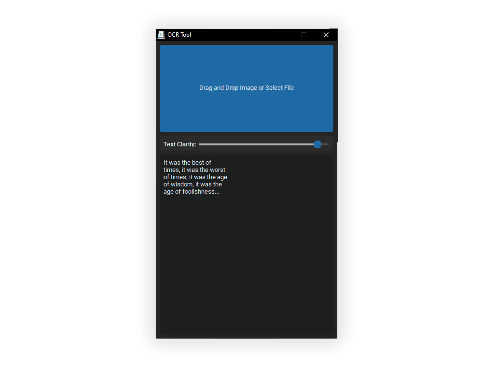

<h1 align="center">OCR-TOOL</h1>

    
Free, Secure, easy-to-use Optical Character Recognition

    
A straightforward tool for your simplest need.

    <a href="github.com/furkansancu/ocr-tool/releases/latest" style="font-size:0.8em">Download</a>

 

  

## Getting Started
#### ⏳ Installation

- Download the <a href="https://github.com/furkansancu/ocr-tool/tags">lastest version of OCR-TOOL</a>.
- Download and install <a href="https://github.com/UB-Mannheim/tesseract/wiki">Tesseract</a>.
- Open OCR-TOOL
- Locate the `tesseract.exe` file path from the Tesseract folder.
- Enjoy 🎉

#### 🖐 How to use ?
- Area on top is the Drag and Drop area, you can either click to locate your image file or you can drop your image to process.
- Use the Text Clarity slider to set the clarity of texts in the image, it is useful for crowded images.
    - Different clarity levels will give you different results. 
- Bottom area is the result place where the output text of the image appear.

## About Project

#### Contributing
Feel free to [contribute](https://github.com/furkansancu/ocr-tool/pulls) our project from Github.

#### License
See the [License](./LICENSE) file for licensing information.
